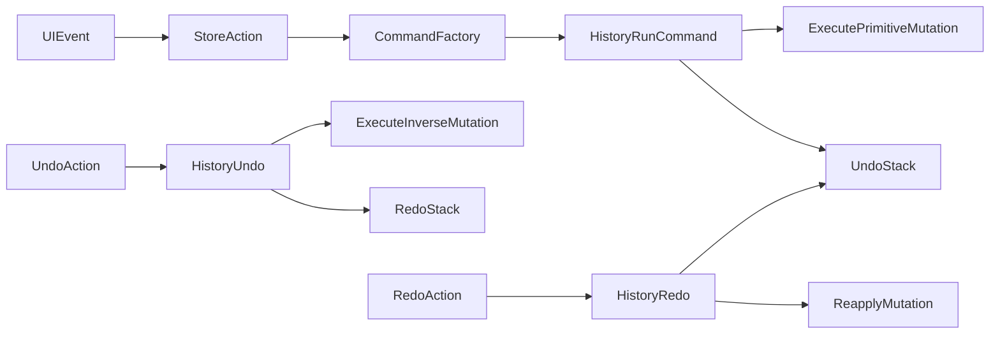

# Command History Module Plan

## Goal

Implement a decoupled undo/redo subsystem that records UI actions as commands (not full workflow snapshots), with bounded history size from centralized config. Initial scope includes graph mutations and config-panel edits.

## Implementation Outline

1. Introduce centralized history limits and behavior flags in [src/config/workflowConstants.ts](src/config/workflowConstants.ts)

- Add constants for:
  - max undo stack size (required)
  - optional coalescing window for move actions (if needed later)
- Keep all hardcoded policy values in this config object.

1. Add a dedicated command-history module in [src/stores/helpers/workflowCommandHistory.ts](src/stores/helpers/workflowCommandHistory.ts)

- Create a generic `WorkflowCommand` contract:
  - `execute()`
  - `undo()`
  - `redo()` (or `execute` reuse)
  - metadata (`type`, `timestamp`, optional `label`)
- Create `WorkflowCommandHistory` manager:
  - `runCommand(command)`
  - `undo()`
  - `redo()`
  - `canUndo`, `canRedo`, `clear()`
- Data structure:
  - `undoStack: WorkflowCommand[]`
  - `redoStack: WorkflowCommand[]`
  - bounded by centralized `maxUndoSteps`.

1. Add command factories for workflow actions in [src/stores/helpers/workflowCommandFactories.ts](src/stores/helpers/workflowCommandFactories.ts)

- Graph commands (action-based inverse only):
  - `AddNodeCommand`, `RemoveNodeCommand`
  - `AddEdgeCommand`, `RemoveEdgeCommand`
  - `MoveNodeCommand`
- Config command (snapshot exception requested):
  - `UpdateNodeConfigCommand` storing node-level `beforeConfigSnapshot` and `afterConfigSnapshot`.
- Each command must encapsulate only one responsibility and depend on store mutation primitives.

1. Refactor store mutation API to separate primitives from command-wrapped actions in [src/stores/workflowCanvasStore.ts](src/stores/workflowCanvasStore.ts)

- Keep pure mutation primitives (no history push) for internal use, e.g.:
  - `applyAddNodePrimitive`
  - `applyRemoveNodePrimitive`
  - `applyAddEdgePrimitive`
  - `applyRemoveEdgePrimitive`
  - `applyMoveNodePrimitive`
  - `applyNodeConfigPrimitive`
- Public UI-facing actions create and run commands through `WorkflowCommandHistory`.
- Add store actions:
  - `undoLastUiAction()`
  - `redoLastUiAction()`
  - `canUndoUiAction`, `canRedoUiAction` getters.
- Preserve existing consistency checks via `runAtomicGraphMutation`.
- Ensure undo/redo paths can skip autosave recursion where needed.

1. Wire UI triggers for undo/redo

- Add header controls in [src/components/AppHeader.vue](src/components/AppHeader.vue):
  - Undo button
  - Redo button
  - disabled state from store getters.
- Add keyboard shortcuts in [src/components/WorkFlowCanvas.vue](src/components/WorkFlowCanvas.vue) or app root [src/App.vue](src/App.vue):
  - Ctrl/Cmd+Z => undo
  - Ctrl/Cmd+Y and Ctrl/Cmd+Shift+Z => redo
- Keep handlers thin; delegate to store.

1. Add focused tests

- Create tests for history manager and command behavior in:
  - [src/stores/helpers/workflowCommandHistory.test.ts](src/stores/helpers/workflowCommandHistory.test.ts)
  - extend [src/stores/workflowCanvasStore.test.ts](src/stores/workflowCanvasStore.test.ts)
- Validate:
  - push/undo/redo semantics
  - redo cleared on new command after undo
  - max stack truncation
  - config snapshot restore correctness
  - graph inverse command correctness.

## Data Flow

## Key Design Decisions (Pros / Cons)

- Action-based commands for graph operations
  - Pros: low memory, explicit intent, scalable for large workflows.
  - Cons: reverse logic must be correct for each command type.
- Node-level config snapshots for config-panel edits
  - Pros: robust for complex config fields (`json`, `array`) and easier rollback integrity.
  - Cons: slightly higher per-command memory than field-level diffs.
- Separate history module from store
  - Pros: reusable, testable, SRP-aligned.
  - Cons: adds extra abstraction layer and factory wiring.

## Rollout Sequence

1. Constants + history manager module.
2. Command factories.
3. Store refactor to primitive-vs-command split.
4. UI trigger wiring.
5. Tests and lint verification.
