# Theme Store and Simple Primitive Naming Replan

## Decisions Locked

- Primitive component names will use `Base` prefix: `BaseTypography`, `BaseButton`, `BaseSurface`, `BaseInput`.
- Primitive components will live in `[C:/Users/Arya/projects/visual-worflow-stuido-new/src/components/primitives/](C:/Users/Arya/projects/visual-worflow-stuido-new/src/components/primitives/)`.
- No behavioral workflow-engine changes; refactor scope is UI architecture and styling consistency.

## Current-State Anchors

- App bootstrap and Pinia setup already exist in `[C:/Users/Arya/projects/visual-worflow-stuido-new/src/main.ts](C:/Users/Arya/projects/visual-worflow-stuido-new/src/main.ts)`.
- Existing store pattern exists in `[C:/Users/Arya/projects/visual-worflow-stuido-new/src/stores/workflowCanvasStore.ts](C:/Users/Arya/projects/visual-worflow-stuido-new/src/stores/workflowCanvasStore.ts)`.
- Theme/color styles are currently hardcoded in `[C:/Users/Arya/projects/visual-worflow-stuido-new/src/style.css](C:/Users/Arya/projects/visual-worflow-stuido-new/src/style.css)` and scoped component styles.
- Primary UI refactor targets:
  - `[C:/Users/Arya/projects/visual-worflow-stuido-new/src/App.vue](C:/Users/Arya/projects/visual-worflow-stuido-new/src/App.vue)`
  - `[C:/Users/Arya/projects/visual-worflow-stuido-new/src/components/ui/AppHeader.vue](C:/Users/Arya/projects/visual-worflow-stuido-new/src/components/ui/AppHeader.vue)`
  - `[C:/Users/Arya/projects/visual-worflow-stuido-new/src/components/WorkFlowToolBar.vue](C:/Users/Arya/projects/visual-worflow-stuido-new/src/components/WorkFlowToolBar.vue)`
  - `[C:/Users/Arya/projects/visual-worflow-stuido-new/src/components/WorkFlowExecutionLog.vue](C:/Users/Arya/projects/visual-worflow-stuido-new/src/components/WorkFlowExecutionLog.vue)`
  - `[C:/Users/Arya/projects/visual-worflow-stuido-new/src/components/WorkFlowConfigPanel.vue](C:/Users/Arya/projects/visual-worflow-stuido-new/src/components/WorkFlowConfigPanel.vue)`

## Target Architecture

```mermaid
flowchart LR
  userToggle[UserThemeToggle] --> themeStore[themePreferenceStore]
  themeStore --> resolvedTheme[resolvedThemeMode]
  resolvedTheme --> htmlThemeAttr[htmlDataThemeAttribute]
  htmlThemeAttr --> semanticTokens[semanticTokenCssVariables]
  semanticTokens --> basePrimitives[BaseTypographyBaseButtonBaseSurfaceBaseInput]
  basePrimitives --> workflowViews[WorkflowUiComponents]
```

## File and Module Plan

### 1) Centralized Policy Flags

Add `[C:/Users/Arya/projects/visual-worflow-stuido-new/src/config/designSystemFlags.ts](C:/Users/Arya/projects/visual-worflow-stuido-new/src/config/designSystemFlags.ts)` for all fixed policy values:

- `THEME_STORAGE_KEY`
- `DEFAULT_THEME_MODE`
- `RESPONSIVE_BREAKPOINT_VALUES`
- `CONTROL_SIZE_VALUES`
- `SURFACE_RADIUS_VALUES`
- `ELEVATION_LEVEL_VALUES`

This ensures no hardcoded policy constants are spread across components.

### 2) Global Theme Store

Add `[C:/Users/Arya/projects/visual-worflow-stuido-new/src/stores/themePreferenceStore.ts](C:/Users/Arya/projects/visual-worflow-stuido-new/src/stores/themePreferenceStore.ts)` using Pinia with:

- State: `selectedThemeMode`, `resolvedThemeMode`
- Actions: `initializeThemePreference()`, `setThemeMode()`, `toggleThemeMode()`
- Behavior: local persistence + system-theme resolution for `system` mode

Initialize once during app startup in `[C:/Users/Arya/projects/visual-worflow-stuido-new/src/main.ts](C:/Users/Arya/projects/visual-worflow-stuido-new/src/main.ts)`, and set `data-theme` on root element.

### 3) Token and Foundation Layer

Add token/foundation CSS files under:

- `[C:/Users/Arya/projects/visual-worflow-stuido-new/src/designSystem/tokens/](C:/Users/Arya/projects/visual-worflow-stuido-new/src/designSystem/tokens/)`
- `[C:/Users/Arya/projects/visual-worflow-stuido-new/src/designSystem/foundations/](C:/Users/Arya/projects/visual-worflow-stuido-new/src/designSystem/foundations/)`

Token categories:

- Semantic colors for light/dark
- Typography scale
- Spacing and sizing
- Radius and elevation

Foundation styles:

- base reset and root typography
- responsive breakpoints and layout helpers

### 4) Primitive Component Layer (Simple Names)

Create primitives in `[C:/Users/Arya/projects/visual-worflow-stuido-new/src/components/primitives/](C:/Users/Arya/projects/visual-worflow-stuido-new/src/components/primitives/)`:

- `BaseTypography.vue`
- `BaseButton.vue`
- `BaseSurface.vue`
- `BaseInput.vue`

Responsibilities:

- `BaseTypography`: semantic text rendering only
- `BaseButton`: button variants, sizes, and interactive states
- `BaseSurface`: card/container variants and elevation
- `BaseInput`: field shell and validation states

### 5) Incremental Component Refactor

Refactor in this order to reduce risk:

1. `[C:/Users/Arya/projects/visual-worflow-stuido-new/src/components/ui/AppHeader.vue](C:/Users/Arya/projects/visual-worflow-stuido-new/src/components/ui/AppHeader.vue)`
2. `[C:/Users/Arya/projects/visual-worflow-stuido-new/src/components/WorkFlowToolBar.vue](C:/Users/Arya/projects/visual-worflow-stuido-new/src/components/WorkFlowToolBar.vue)`
3. `[C:/Users/Arya/projects/visual-worflow-stuido-new/src/components/WorkFlowExecutionLog.vue](C:/Users/Arya/projects/visual-worflow-stuido-new/src/components/WorkFlowExecutionLog.vue)`
4. `[C:/Users/Arya/projects/visual-worflow-stuido-new/src/components/WorkFlowConfigPanel.vue](C:/Users/Arya/projects/visual-worflow-stuido-new/src/components/WorkFlowConfigPanel.vue)`
5. `[C:/Users/Arya/projects/visual-worflow-stuido-new/src/App.vue](C:/Users/Arya/projects/visual-worflow-stuido-new/src/App.vue)`
6. Global cleanup in `[C:/Users/Arya/projects/visual-worflow-stuido-new/src/style.css](C:/Users/Arya/projects/visual-worflow-stuido-new/src/style.css)`

Refactor rule: replace hardcoded visual values with tokens/primitives; preserve existing workflow behavior.

### 6) Responsive Layout Policy

Apply breakpoint-driven behavior for:

- toolbar width/collapse patterns
- config panel width and mobile drawer behavior
- execution log usable height on small screens

All breakpoint values sourced from centralized flags and mirrored in CSS variable strategy.

## Validation Plan

- Theme switch behavior: `light`, `dark`, `system`
- Theme persistence after reload
- Component consistency across `Base*` primitives
- Responsive checks at mobile/tablet/desktop widths
- Lint check for touched UI/store files
- No regression in import/export/run workflow actions

## Risks and Mitigations

- Risk: temporary mixed old/new styles during migration
  - Mitigation: incremental refactor order and cleanup pass at end
- Risk: token naming drift
  - Mitigation: semantic token naming policy in one token folder and strict usage in primitives only
- Risk: scope creep into logic
  - Mitigation: keep changes in store/theme and presentation layers only
