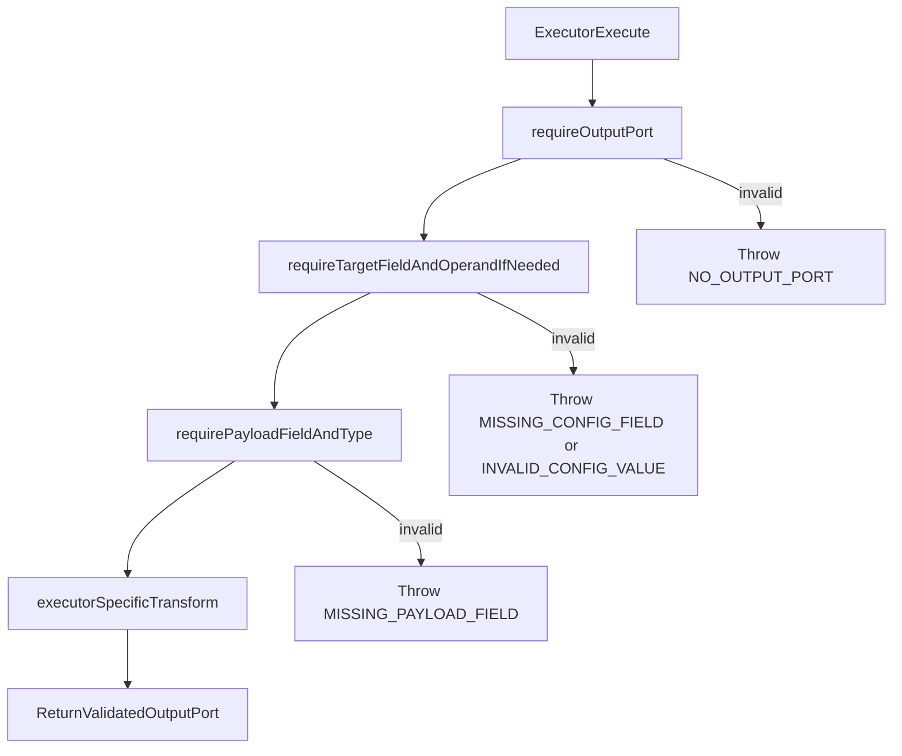

# Transform Executor Strict Validation Plan

## Objective

Replace silent no-op behavior in transform executors with explicit, typed failures using `[src/engine/errors/nodeExecutionError.ts](src/engine/errors/nodeExecutionError.ts)`, then update transform tests to verify happy path, edge path, and error path with error codes.

## Confirmed Runtime Contract

- Validation mode: strict throw.
- Missing target payload field: throw `MISSING_PAYLOAD_FIELD`.
- Invalid config shape: throw `MISSING_CONFIG_FIELD`.
- Invalid operand type/value for numeric transforms: throw `INVALID_CONFIG_VALUE`.
- Invalid operand type/value for string transforms: throw `INVALID_CONFIG_VALUE`.
- Missing output port: throw `NO_OUTPUT_PORT`.

## Design Shape (SRP + Centralized Policy)

- Add a small shared transform validation policy module to avoid repeating literals and checks:
  - `[src/engine/executors/transform/transformExecutorValidationPolicy.ts](src/engine/executors/transform/transformExecutorValidationPolicy.ts)`
- This module will centralize:
  - required config key names (`targetField`, `operand`)
  - reusable guard functions (`requireOutputPort`, `requireTargetField`, `requirePayloadField`, `requireNumericOperand`, `requireStringOperand`)
  - canonical error messages for each failure type
- Each executor keeps one responsibility: transform operation only. Validation responsibility is delegated to shared guards.

## Files To Update

- Executors:
  - `[src/engine/executors/transform/addExecutor.ts](src/engine/executors/transform/addExecutor.ts)`
  - `[src/engine/executors/transform/multiplyExecutor.ts](src/engine/executors/transform/multiplyExecutor.ts)`
  - `[src/engine/executors/transform/roundExecutor.ts](src/engine/executors/transform/roundExecutor.ts)`
  - `[src/engine/executors/transform/appendExecutor.ts](src/engine/executors/transform/appendExecutor.ts)`
  - `[src/engine/executors/transform/prependExecutor.ts](src/engine/executors/transform/prependExecutor.ts)`
  - `[src/engine/executors/transform/uppercaseExecutor.ts](src/engine/executors/transform/uppercaseExecutor.ts)`
  - `[src/engine/executors/transform/lowercaseExecutor.ts](src/engine/executors/transform/lowercaseExecutor.ts)`
  - `[src/engine/executors/transform/noOpExecutor.ts](src/engine/executors/transform/noOpExecutor.ts)`
- Tests:
  - `[src/engine/executors/transform/addExecutor.test.ts](src/engine/executors/transform/addExecutor.test.ts)`
  - `[src/engine/executors/transform/multiplyExecutor.test.ts](src/engine/executors/transform/multiplyExecutor.test.ts)`
  - `[src/engine/executors/transform/roundExecutor.test.ts](src/engine/executors/transform/roundExecutor.test.ts)`
  - `[src/engine/executors/transform/appendExecutor.test.ts](src/engine/executors/transform/appendExecutor.test.ts)`
  - `[src/engine/executors/transform/prependExecutor.test.ts](src/engine/executors/transform/prependExecutor.test.ts)`
  - `[src/engine/executors/transform/uppercaseExecutor.test.ts](src/engine/executors/transform/uppercaseExecutor.test.ts)`
  - `[src/engine/executors/transform/lowercaseExecutor.test.ts](src/engine/executors/transform/lowercaseExecutor.test.ts)`
  - `[src/engine/executors/transform/noOpExecutor.test.ts](src/engine/executors/transform/noOpExecutor.test.ts)`
  - `[src/engine/executors/transform/resolveTransformExecutor.test.ts](src/engine/executors/transform/resolveTransformExecutor.test.ts)`

## Validation And Execution Flow

## Test Strategy Update

- Keep current happy path tests.
- Replace silent no-op invalid-input assertions with throw assertions:
  - `toThrowError(NodeExecutionError)`
  - then assert `errorCode` (same style used in existing decision/switch tests).
- Add explicit error tests per executor family:
  - numeric: missing `targetField`, missing payload field, invalid/non-finite `operand`, empty output ports
  - string: missing `targetField`, missing payload field, non-string `operand`, empty output ports
  - no-op: keep non-transform behavior but enforce output-port contract if desired (throw `NO_OUTPUT_PORT`) for consistency
- Keep resolver mapping tests; no change in mapping logic expected.

## Pros And Cons Of This Direction

- Pros:
  - Invalid workflow configuration fails fast with typed error codes.
  - Engine/UI can render deterministic diagnostics.
  - Test intent becomes explicit and reliable for bad-node scenarios.
  - Centralized validation policy removes duplicated literals and rule drift.
- Cons:
  - Behavior change from tolerant to strict can break existing workflows relying on no-op fallback.
  - Additional guard layer introduces more branching and test cases.
  - Error messages and codes become part of contract and require version discipline.

## Verification

- Run targeted tests: `npm test -- src/engine/executors/transform`
- Run broader executor tests to ensure no regression in engine semantics.
- Check lint diagnostics for updated transform executor and test files.
