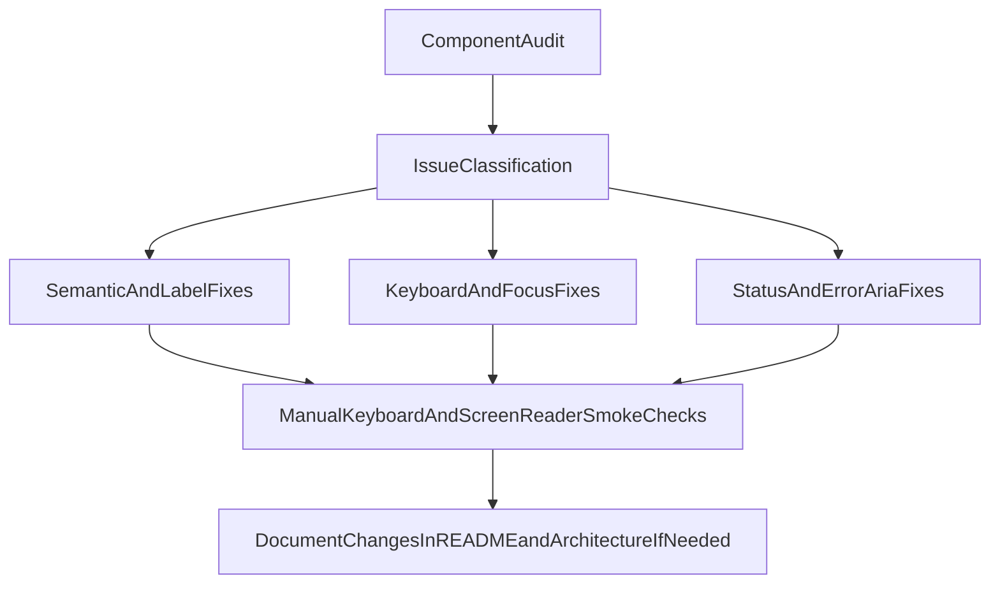

# UI Accessibility Remediation Plan

## Goal

Execute a full UI component accessibility pass, identify concrete issues, and fix them in-place without adding new lint/test tooling.

## Scope

- Include all core UI surfaces: header, toolbar, canvas wrappers, config panel, modal, execution log, node/edge renderers, and primitive components.
- Prioritize WCAG-aligned fixes for keyboard access, semantic labeling, focus visibility, and assistive-technology naming.
- Exclude new dependencies and CI/tooling setup in this pass.

## Target Files

- Primitives: [C:/Users/Arya/projects/visual-worflow-stuido-new/src/components/primitives/BaseInput.vue](C:/Users/Arya/projects/visual-worflow-stuido-new/src/components/primitives/BaseInput.vue), [C:/Users/Arya/projects/visual-worflow-stuido-new/src/components/primitives/BaseButton.vue](C:/Users/Arya/projects/visual-worflow-stuido-new/src/components/primitives/BaseButton.vue)
- Forms/config: [C:/Users/Arya/projects/visual-worflow-stuido-new/src/components/WorkFlowConfigPanel.vue](C:/Users/Arya/projects/visual-worflow-stuido-new/src/components/WorkFlowConfigPanel.vue), [C:/Users/Arya/projects/visual-worflow-stuido-new/src/components/workflowConfig/WorkflowArrayConfigField.vue](C:/Users/Arya/projects/visual-worflow-stuido-new/src/components/workflowConfig/WorkflowArrayConfigField.vue), [C:/Users/Arya/projects/visual-worflow-stuido-new/src/components/workflowConfig/WorkflowJsonConfigField.vue](C:/Users/Arya/projects/visual-worflow-stuido-new/src/components/workflowConfig/WorkflowJsonConfigField.vue)
- Modal/dialog: [C:/Users/Arya/projects/visual-worflow-stuido-new/src/components/GlobalActionModal.vue](C:/Users/Arya/projects/visual-worflow-stuido-new/src/components/GlobalActionModal.vue)
- Navigation/actions: [C:/Users/Arya/projects/visual-worflow-stuido-new/src/components/AppHeader.vue](C:/Users/Arya/projects/visual-worflow-stuido-new/src/components/AppHeader.vue), [C:/Users/Arya/projects/visual-worflow-stuido-new/src/components/WorkFlowToolBar.vue](C:/Users/Arya/projects/visual-worflow-stuido-new/src/components/WorkFlowToolBar.vue), [C:/Users/Arya/projects/visual-worflow-stuido-new/src/components/nodeRenderers/NodeRendererWrapper.vue](C:/Users/Arya/projects/visual-worflow-stuido-new/src/components/nodeRenderers/NodeRendererWrapper.vue), [C:/Users/Arya/projects/visual-worflow-stuido-new/src/components/WorkFlowExecutionLog.vue](C:/Users/Arya/projects/visual-worflow-stuido-new/src/components/WorkFlowExecutionLog.vue)

## Execution Flow

## Implementation Steps

1. Baseline component audit

- Inspect each target component for these issue classes:
  - Missing accessible names (`aria-label`, `aria-labelledby`) on icon-only controls.
  - Missing label-input binding (`for`/`id`) for form controls.
  - Missing error-state semantics (`aria-invalid`, `aria-describedby`).
  - Keyboard traps / missing keyboard close paths in modal flows.
  - Weak focus indication (`outline: none` without equivalent visible focus style).

1. Primitive-first remediation

- Update `BaseInput` to support explicit control IDs, linked labels, and descriptive/error ARIA hooks.
- Update `BaseButton` to support icon-only accessibility naming and state exposure for loading/disabled behavior.
- Keep SRP by adding only accessibility-facing props/behavior in primitives and reusing them in parents.

1. Form and config remediation

- Refactor config field rendering to use proper `label for` -> `input id` wiring.
- Ensure array/json field error text has deterministic IDs and gets referenced via `aria-describedby`.
- Ensure checkbox and select controls have explicit accessible names when visual labels are not sufficient.

1. Modal and interaction remediation

- Add dialog focus lifecycle: initial focus on open, Escape close path, and focus restore on close.
- Maintain `role="dialog"` and `aria-modal`, and move title association to `aria-labelledby` where possible.

1. Action controls and navigation remediation

- Add accessible names for icon/emoji action buttons in header, toolbar, and node wrapper controls.
- Add toolbar/list semantics where appropriate without changing visual structure.
- Confirm drag-and-drop-only interactions expose at least understandable non-pointer affordances and labels.

1. Validation pass (manual only)

- Keyboard-only walk-through: Tab/Shift+Tab order, Enter/Space activation, Escape in modal.
- Screen-reader smoke checks on key paths: open modal, edit config form, run workflow, inspect logs.
- Visual focus check across dark/light themes to ensure focus indicators remain high contrast.

## Acceptance Criteria

- Every interactive element has a programmatic accessible name.
- All form controls are programmatically associated with labels and error/help text.
- Modal supports open/close keyboard lifecycle with predictable focus handling.
- Focus indicators are visible and perceivable on all critical controls.
- No regressions in existing behavior for workflow editing/execution flows.

## Trade-offs

- Pros: Immediate accessibility uplift with minimal architectural churn; no dependency or CI overhead.
- Cons: Manual validation only; regression risk remains higher without automated checks in future changes.

## Out of Scope

- Adding ESLint accessibility plugins, Testing Library a11y tests, axe, Lighthouse, or CI enforcement.
