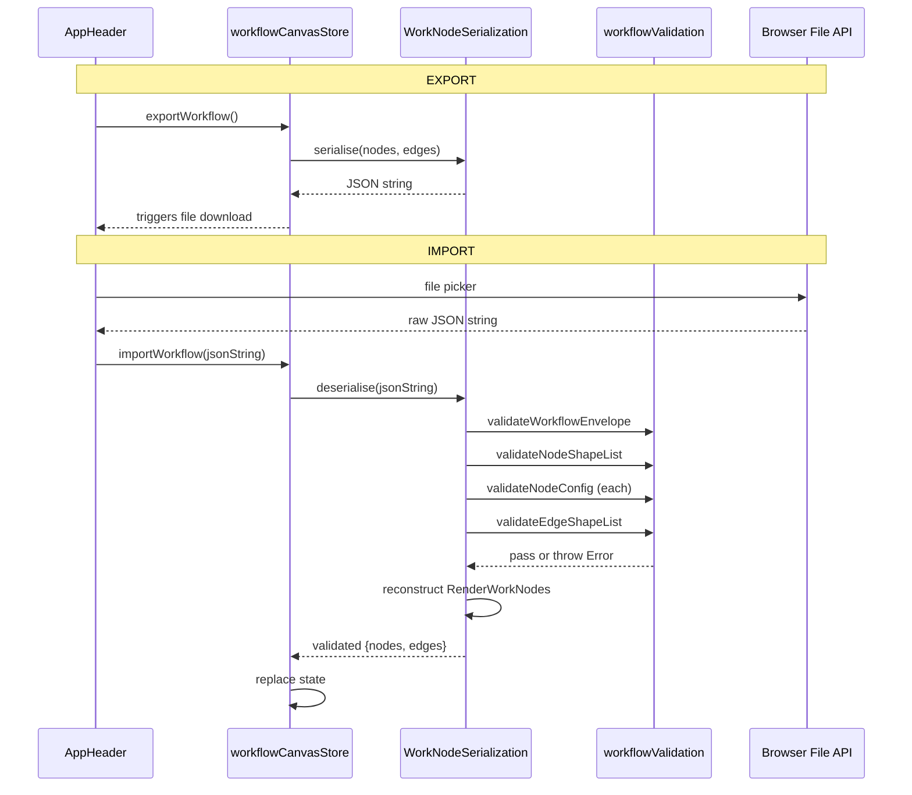
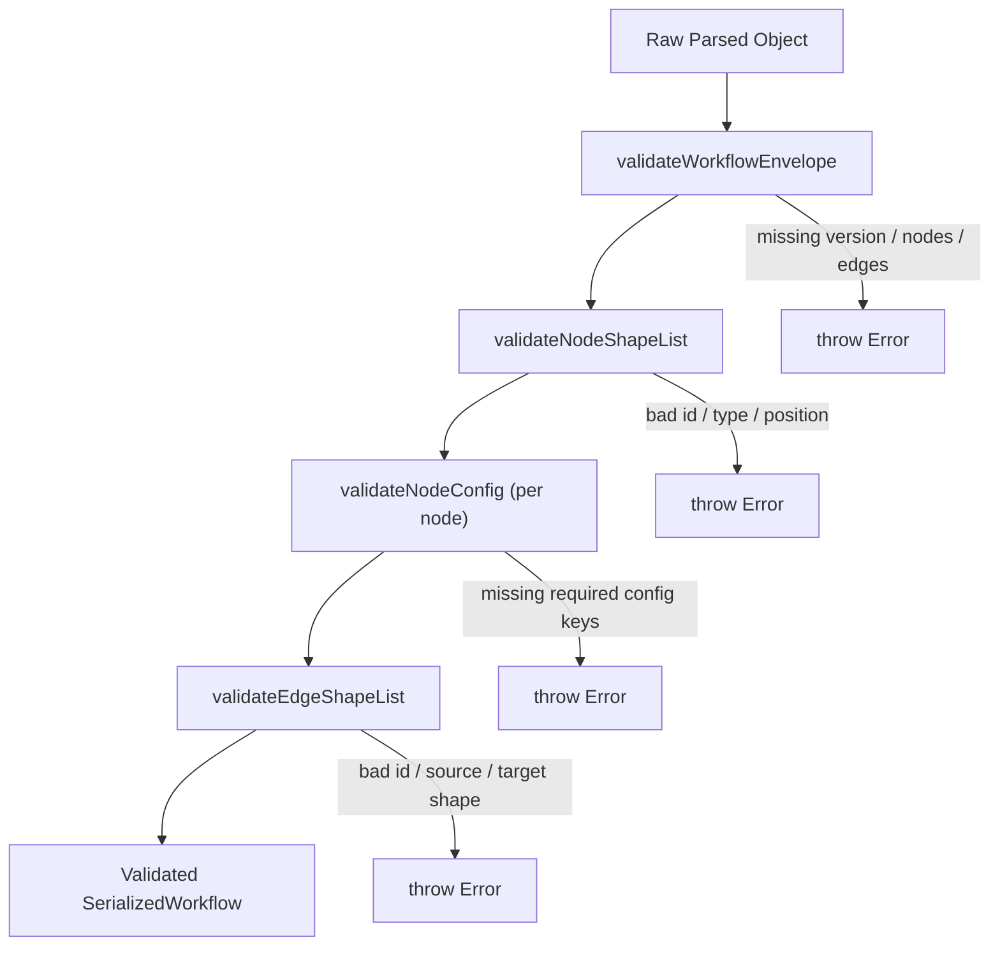

# Workflow JSON Serialization Plan

## Data Flow



## 1. Add Serialization Constants to `workflowConstants.ts`

In [src/config/workflowConstants.ts](src/config/workflowConstants.ts), add:

```typescript
SERIALIZATION_FORMAT_VERSION: '1.0.0',
VALID_NODE_TYPES: ['START', 'TRANSFORM', 'DECISION', 'END'] as const,
```

All magic values (version string, valid types) stay centralized here.

---

## 2. Create Serialization Types at `src/models/serialization.ts`

Define the shape of the exported JSON:

```typescript
interface SerializedWorkNode {
  id: string;
  type: string;
  position: { x: number; y: number };
  config: Record<string, unknown>;
}

interface SerializedEdge {
  id: string;
  source: string;
  sourceHandle: string | null;
  target: string;
  targetHandle: string | null;
}

interface SerializedWorkflow {
  version: string;
  exportedAt: string;
  nodes: SerializedWorkNode[];
  edges: SerializedEdge[];
}
```

This is the **contract** -- what gets written to and read from JSON. Clean separation from internal `RenderWorkNode` / Vue Flow `Edge` types.

---

## 3. Create Validation Helper at `src/serialization/workflowValidation.ts`

**Single Responsibility: validate the raw parsed JSON before it touches the store.**

Separate file from the serializer -- keeps validation logic isolated and testable.

### Validation Pipeline (called from `deserialise`)



### Functions

#### `validateWorkflowEnvelope(data: unknown): asserts data is SerializedWorkflow`

- `version` must be string, must match `SERIALIZATION_FORMAT_VERSION`.
- `nodes` must be array.
- `edges` must be array.

#### `validateNodeShapeList(nodes: unknown[]): asserts nodes is SerializedWorkNode[]`

Per node:

- `id` -- non-empty string.
- `type` -- must exist in `VALID_NODE_TYPES`.
- `position` -- object with numeric `x` and `y`.
- `config` -- must be a plain object (not null, not array).
- Throw with the index + id of the offending node.

#### `validateNodeConfig(node: SerializedWorkNode): void`

- Look up `NodeDefinition` via `getNodeDefinition(node.type)`.
- Walk the definition's `configSchema` array. For each `ConfigFieldDefinition`:
  - Check that `node.config` contains the `key`. If missing, fill from `defaultValue` in schema (self-healing, not a hard fail).
  - If key is present, validate type alignment with `fieldType`:
    - `text` / `select` -> value should be string
    - `number` -> value should be number
    - `json` -> value should be object
    - `checkbox` -> value should be boolean
  - If type mismatch: throw with `"Node [id]: config key [key] expected [fieldType] but got [actual type]"`.
- Extra keys in config that are NOT in the schema are **silently dropped** (defense against stale/tampered JSON).

#### `validateEdgeShapeList(edges: unknown[]): asserts edges is SerializedEdge[]`

Per edge:

- `id`, `source`, `target` -- non-empty strings (required).
- `sourceHandle`, `targetHandle` -- string or null (optional).
- Dangling references (source/target pointing to a node not in the nodes list) are **allowed** -- only shape is enforced.
- Throw with the index + id of the offending edge.

All functions throw plain `Error` objects with descriptive messages. No UI logic.

---

## 4. Create `WorkNodeSerialization` class at `src/serialization/workNodeSerialization.ts`

Single Responsibility: pure data transformation. Delegates validation to `workflowValidation.ts`. **No UI, no store awareness.**

### `serialise(nodes: RenderWorkNode[], edges: Edge[]): string`

- Maps each `RenderWorkNode` to `SerializedWorkNode` (extracts `id`, `type`, `position`, `config` from `data.workNode`).
- Maps each Vue Flow `Edge` to `SerializedEdge` (extracts only the 5 fields above).
- Stamps `version` from `WORKFLOW_CONSTANTS.SERIALIZATION_FORMAT_VERSION` and `exportedAt` as ISO timestamp.
- Returns `JSON.stringify(serializedWorkflow, null, 2)`.

### `deserialise(jsonString: string): { nodes: RenderWorkNode[]; edges: Edge[] }`

Step-by-step pipeline:

1. **Parse** -- `JSON.parse`, catch and throw descriptive error.
2. **Validate envelope** -- `validateWorkflowEnvelope(parsed)`.
3. **Validate nodes** -- `validateNodeShapeList(parsed.nodes)`.
4. **Validate config per node** -- Loop: `validateNodeConfig(node)` for each node.
5. **Validate edges** -- `validateEdgeShapeList(parsed.edges)`.
6. **Reconstruct** -- Use `createWorkNode()` from [src/factory/workNodeFactory.ts](src/factory/workNodeFactory.ts) + `getNodeDefinition()` to rebuild `BaseWorkNode` instances, then overlay the validated `config`. Wrap into `RenderWorkNode` objects with saved positions. Map edges back to Vue Flow `Edge` shape.
7. **Return** `{ nodes, edges }`.

Errors are thrown as standard `Error` objects. The store catches them.

---

## 5. Add Store Actions in `workflowCanvasStore.ts`

In [src/stores/workflowCanvasStore.ts](src/stores/workflowCanvasStore.ts), add two actions:

### `exportWorkflow(): string`

- Calls `WorkNodeSerialization.serialise(this.nodes, this.edges)`.
- Returns the JSON string (the UI component triggers the file download).

### `importWorkflow(jsonString: string): void`

- Wraps `WorkNodeSerialization.deserialise(jsonString)` in try/catch.
- On success: replaces `this.nodes`, `this.edges`, clears `selectedNodeId` and `executionLog`.
- On error: pushes a system error entry into `executionLog` (same pattern as `runWorkflow` error handling) so the user sees it in the execution log panel. **No UI code in store** -- just data.

---

## 6. Modify `AppHeader.vue`

In [src/components/ui/AppHeader.vue](src/components/ui/AppHeader.vue):

- Add an **actions section** to the right side of the header (flex `justify-content: space-between`).
- Two buttons: **Export** and **Import**.
- **Export button** (`click`): calls `store.exportWorkflow()`, creates a `Blob`, generates a download link via `URL.createObjectURL`, triggers click, revokes URL. All browser file-download logic lives here in the component.
- **Import button** (`click`): creates a hidden `<input type="file" accept=".json">`, triggers click, reads file via `FileReader`, passes the string to `store.importWorkflow(jsonString)`.
- Styled consistently with the existing dark header theme (`#1e1e2e` background, `#cdd6f4` text, subtle border buttons).

---

## File Impact Summary

| File                                         | Change                                                   |
| -------------------------------------------- | -------------------------------------------------------- |
| `src/config/workflowConstants.ts`            | Add version + valid types                                |
| `src/models/serialization.ts`                | **New** -- serialized shape interfaces                   |
| `src/serialization/workflowValidation.ts`    | **New** -- envelope, node, config, edge shape validators |
| `src/serialization/workNodeSerialization.ts` | **New** -- the serialise/deserialise class               |
| `src/stores/workflowCanvasStore.ts`          | Add `exportWorkflow` + `importWorkflow` actions          |
| `src/components/ui/AppHeader.vue`            | Add Export/Import buttons                                |
