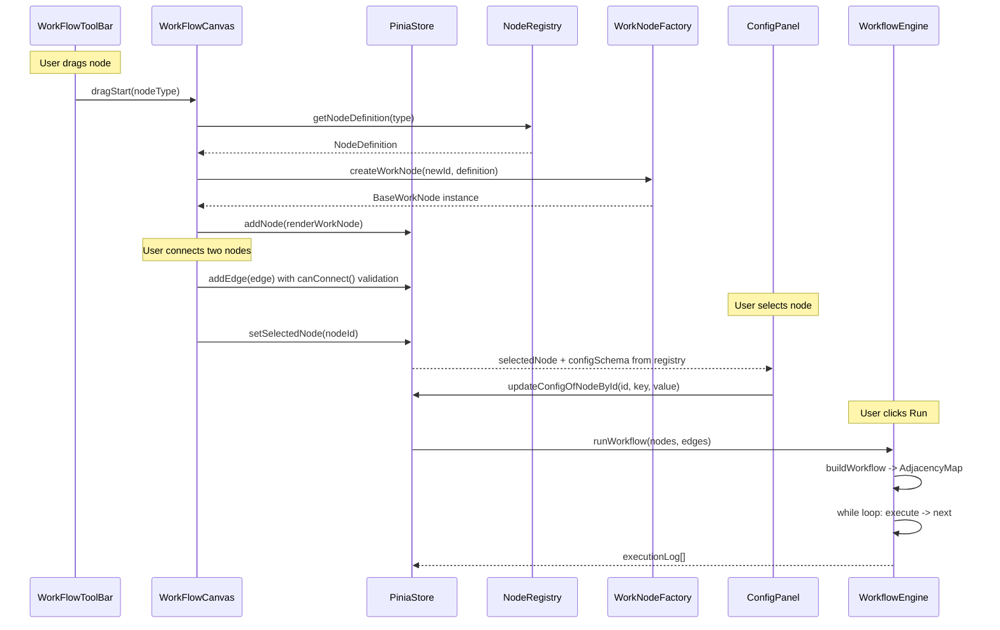

# Low-Level Design: Visual Workflow Studio

## 1. Node Registry -- Single Source of Truth

Every node type is declared once. Toolbar, ConfigPanel, and Executor all derive from this.

```typescript
// src/registry/nodeRegistry.ts

interface NodeDefinition {
  type: string; // e.g. 'START', 'TRANSFORM', 'DECISION', 'END'
  label: string; // e.g. 'Transform Node'
  category: "trigger" | "processor" | "control" | "terminal";
  icon: string; // icon name or path
  portDefinition: PortDefinition;
  defaultConfig: Record<string, unknown>; // initial config when dropped
  configSchema: ConfigFieldDefinition[]; // drives dynamic form in ConfigPanel
  executorResolver: (config: Record<string, unknown>) => NodeExecutor;
}

// The registry itself
const NODE_REGISTRY: Map<string, NodeDefinition> = new Map();

function registerNode(definition: NodeDefinition): void;
function getNodeDefinition(type: string): NodeDefinition;
function getAllNodeDefinitions(): NodeDefinition[];
```

**Adding a new node:** Call `registerNode(...)` with a definition + write the executor class. Done.

```
registerNode({
  type: 'TRANSFORM',
  label: 'Transform',
  category: 'processor',
  icon: 'transform-icon',
  portDefinition: { inputCount: 1, outputPorts: [{ id: 'out-0', label: 'Output' }] },
  defaultConfig: { mode: 'UPPERCASE', targetField: 'message' },
  configSchema: [
    { key: 'mode', label: 'Mode', fieldType: 'select', options: ['UPPERCASE','LOWERCASE','APPEND','PREPEND','MULTIPLY','ADD','ROUND'] },
    { key: 'targetField', label: 'Target Field', fieldType: 'text' },
    { key: 'operand', label: 'Value', fieldType: 'text', visibleWhen: { field: 'mode', in: ['APPEND','PREPEND','MULTIPLY','ADD'] } }
  ],
  executorResolver: (config) => resolveTransformExecutor(config)
})
```

---

## 2. Config Schema and Dynamic Form Rendering

The ConfigPanel reads `configSchema` from the registry and renders a form dynamically -- no per-node-type hardcoded templates.

```typescript
// src/models/configSchema.ts

interface ConfigFieldDefinition {
  key: string; // maps to config[key]
  label: string; // display label
  fieldType: "text" | "number" | "select" | "json" | "checkbox";
  options?: string[]; // for 'select' fieldType
  defaultValue?: unknown;
  placeholder?: string;
  visibleWhen?: {
    // conditional visibility
    field: string; // another config key
    in: unknown[]; // show when that field's value is in this list
  };
}
```

```
 ConfigPanel rendering flow:
 ┌──────────────────────────────────────────────┐
 │  selectedNodeId                              │
 │       │                                      │
 │       ▼                                      │
 │  store.getNodeById(id)                       │
 │       │                                      │
 │       ▼                                      │
 │  workNode.type ──► registry.get(type)        │
 │                         │                    │
 │                         ▼                    │
 │                    configSchema[]            │
 │                         │                    │
 │              ┌──────────┼──────────┐         │
 │              ▼          ▼          ▼         │
 │          TextField  SelectField  NumberField │
 │              │          │          │         │
 │              └──────────┼──────────┘         │
 │                         ▼                    │
 │              v-model ←→ store.updateConfig() │
 └──────────────────────────────────────────────┘
```

---

## 3. Ports -- Definition, Identity, and Edge Validation

```typescript
// src/models/ports.ts

interface PortDefinition {
  inputCount: number; // typically 1 (how many inputs accepted)
  outputPorts: OutputPortDefinition[]; // named outputs
}

interface OutputPortDefinition {
  id: string; // e.g. 'out-0', 'true-branch', 'false-branch'
  label: string; // e.g. 'Output', 'True', 'False'
}
```

**Port definitions per node type:**

- **StartNode:** `{ inputCount: 0, outputPorts: [{ id: 'out-0', label: 'Output' }] }`
- **TransformNode:** `{ inputCount: 1, outputPorts: [{ id: 'out-0', label: 'Output' }] }`
- **DecisionNode:** `{ inputCount: 1, outputPorts: [{ id: 'true-branch', label: 'True' }, { id: 'false-branch', label: 'False' }] }`
- **EndNode:** `{ inputCount: 1, outputPorts: [] }`

**Edge Validation Rules (enforced on connect):**

```
canConnect(sourceNodeId, sourcePortId, targetNodeId): boolean
  1. targetNode.portDefinition.inputCount > 0
  2. No self-loops (sourceNodeId !== targetNodeId)
  3. Target input not already occupied (1 edge per input for v1)
  4. StartNode cannot be a target
  5. EndNode cannot be a source
```

---

## 4. WorkflowContext -- Data Flowing Through the Graph

```typescript
// src/engine/workflowContext.ts

interface WorkflowContext {
  payload: Record<string, unknown>; // the data being transformed node-to-node
  executionLog: ExecutionLogEntry[]; // accumulated trace
}
```

- Created fresh at the start of each "Run Workflow" invocation.
- `payload` starts with StartNode's configured input payload.
- Each executor reads `payload`, transforms it, writes back. The engine snapshots before/after for the log.

---

## 5. DAG Builder and Traversal (WorkflowEngine)

```typescript
// src/engine/workflowEngine.ts

interface AdjacencyEntry {
  sourcePortId: string;
  targetNodeId: string;
}

type AdjacencyMap = Map<string, AdjacencyEntry[]>; // nodeId -> outgoing edges
```

**buildWorkflow:**

```
buildWorkflow(nodes: RenderWorkNode[], edges: Edge[]): AdjacencyMap
  1. Create Map<nodeId, AdjacencyEntry[]>
  2. For each edge: adjacency[edge.source].push({ sourcePortId: edge.sourceHandle, targetNodeId: edge.target })
  3. Validate: exactly 1 StartNode, at least 1 EndNode
  4. Return adjacency map
```

**executeWorkflow -- the main loop:**

```
 ┌────────────────────────────────────────────────┐
 │  executeWorkflow(nodes, edges)                 │
 │                                                │
 │  adjacency = buildWorkflow(nodes, edges)       │
 │  startNode = findNodeByType('START')           │
 │  context = { payload: startNode.config.input,  │
 │              executionLog: [] }                 │
 │                                                │
 │  currentNode = startNode                       │
 │       │                                        │
 │       ▼                                        │
 │  ┌─── WHILE currentNode !== null ───┐          │
 │  │                                  │          │
 │  │  snapshotInput = clone(payload)  │          │
 │  │         │                        │          │
 │  │         ▼                        │          │
 │  │  executor = currentNode          │          │
 │  │    .workNode.getExecutor()       │          │
 │  │         │                        │          │
 │  │         ▼                        │          │
 │  │  selectedPort = executor         │          │
 │  │    .execute(context,             │          │
 │  │      config, outputPorts)        │          │
 │  │         │                        │          │
 │  │         ▼                        │          │
 │  │  log(nodeId, snapshotInput,      │          │
 │  │      clone(payload), port)       │          │
 │  │         │                        │          │
 │  │         ▼                        │          │
 │  │  if selectedPort === null        │          │
 │  │    → currentNode = null (END)    │          │
 │  │  else                            │          │
 │  │    → look up adjacency           │          │
 │  │      [nodeId][portId]            │          │
 │  │    → currentNode = targetNode    │          │
 │  │                                  │          │
 │  └──────────────────────────────────┘          │
 │                                                │
 │  return context.executionLog                   │
 └────────────────────────────────────────────────┘
```

**Safety:** Add a `MAX_EXECUTION_STEPS` constant (centralized config, e.g., 100) to prevent infinite loops.

---

## 6. Execution Log Structure

```typescript
// src/models/executionLog.ts

interface ExecutionLogEntry {
  stepNumber: number;
  nodeId: string;
  nodeLabel: string;
  nodeType: string;
  inputPayload: Record<string, unknown>; // snapshot BEFORE execute
  outputPayload: Record<string, unknown>; // snapshot AFTER execute
  selectedPortId: string | null; // which output port was chosen
  nextNodeId: string | null; // resolved from adjacency
  status: "success" | "error";
  errorMessage?: string;
  timestamp: number;
}
```

Example trace for `Start -> Transform(UPPERCASE) -> End`:

```
Step 1 | START     | in: {}                      | out: { message: "hello" }   | port: out-0
Step 2 | TRANSFORM | in: { message: "hello" }    | out: { message: "HELLO" }   | port: out-0
Step 3 | END       | in: { message: "HELLO" }    | out: { message: "HELLO" }   | port: null
```

---

## 7. RenderWorkNode -- Vue Flow Bridge

```typescript
// src/models/renderWorkNode.ts

interface RenderWorkNode extends VueFlowNode {
  data: {
    workNode: BaseWorkNode; // the logic instance
  };
}
```

**Lifecycle: Drag to Render**

```
 Toolbar                    Canvas                           Store
    │                          │                                │
    │  dragStart(nodeType)     │                                │
    │─────────────────────────▶│                                │
    │                          │                                │
    │              onDrop(event, position)                      │
    │                          │                                │
    │                          │  1. type = getDragData()       │
    │                          │  2. def = registry.get(type)   │
    │                          │  3. workNode = WorkNodeFactory │
    │                          │       .create(newId, def)      │
    │                          │  4. renderNode = {             │
    │                          │       id, type, position,      │
    │                          │       data: { workNode }       │
    │                          │     }                          │
    │                          │──────────────────────────────▶ │
    │                          │     store.addNode(renderNode)  │
    │                          │                                │
```

**Config sync (user edits in ConfigPanel):**

```
ConfigPanel                          Store
    │                                  │
    │  onFieldChange(key, value)       │
    │─────────────────────────────────▶│
    │                                  │  store.updateConfigOfNodeById(
    │                                  │    selectedNodeId, key, value)
    │                                  │
    │                                  │  → mutates renderNode.data
    │                                  │     .workNode.config[key]
    │                                  │
```

Both directions are reactive because Pinia + Vue reactivity tracks `workNode.config` as a reactive object.

---

## 8. WorkNode Class Hierarchy (Refined)

```typescript
// src/models/baseWorkNode.ts

abstract class BaseWorkNode {
  id: string;
  type: string;
  config: Record<string, unknown>;

  constructor(
    id: string,
    type: string,
    defaultConfig: Record<string, unknown>,
  ) {
    this.id = id;
    this.type = type;
    this.config = { ...defaultConfig };
  }

  abstract getExecutor(): NodeExecutor;
}
```

```typescript
// src/models/nodes/startWorkNode.ts
class StartWorkNode extends BaseWorkNode {
  getExecutor(): NodeExecutor {
    return new StartExecutor();
  }
}

// src/models/nodes/transformWorkNode.ts
class TransformWorkNode extends BaseWorkNode {
  getExecutor(): NodeExecutor {
    return resolveTransformExecutor(this.config);
  }
}

// src/models/nodes/decisionWorkNode.ts
class DecisionWorkNode extends BaseWorkNode {
  getExecutor(): NodeExecutor {
    return new DropdownDecisionExecutor();
  }
}

// src/models/nodes/endWorkNode.ts
class EndWorkNode extends BaseWorkNode {
  getExecutor(): NodeExecutor {
    return new EndExecutor();
  }
}
```

---

## 9. Executor Classes (Refined)

```typescript
// src/engine/executors/nodeExecutor.ts

interface NodeExecutor {
  execute(
    context: WorkflowContext,
    config: Record<string, unknown>,
    outputPorts: OutputPortDefinition[],
  ): OutputPortDefinition | null; // null = terminal (EndNode)
}
```

**StartExecutor:** Sets `context.payload` from `config.inputPayload`. Returns `outputPorts[0]`.

**TransformExecutors (one per mode):**

```
resolveTransformExecutor(config):
  'UPPERCASE'  → UppercaseExecutor    // payload[field].toUpperCase()
  'LOWERCASE'  → LowercaseExecutor
  'APPEND'     → AppendExecutor       // payload[field] += config.operand
  'PREPEND'    → PrependExecutor
  'MULTIPLY'   → MultiplyExecutor     // payload[field] *= config.operand
  'ADD'        → AddExecutor
  'ROUND'      → RoundExecutor
  default      → NoOpExecutor (pass-through)
```

Each returns `outputPorts[0]`.

**DropdownDecisionExecutor:**

```
execute(context, config, outputPorts):
  fieldValue = context.payload[config.targetField]
  result = compare(fieldValue, config.operator, config.compareValue)
  return result ? outputPorts[0] : outputPorts[1]    // true-branch or false-branch

  where operator is one of: '>', '<', '==', '!=', 'contains'
```

**EndExecutor:** No-op. Returns `null` (signals engine to stop).

---

## 10. WorkNodeFactory

```typescript
// src/factory/workNodeFactory.ts

function createWorkNode(id: string, definition: NodeDefinition): BaseWorkNode {
  switch (definition.type) {
    case "START":
      return new StartWorkNode(id, definition.type, definition.defaultConfig);
    case "TRANSFORM":
      return new TransformWorkNode(
        id,
        definition.type,
        definition.defaultConfig,
      );
    case "DECISION":
      return new DecisionWorkNode(
        id,
        definition.type,
        definition.defaultConfig,
      );
    case "END":
      return new EndWorkNode(id, definition.type, definition.defaultConfig);
    default:
      throw new Error(`Unknown node type: ${definition.type}`);
  }
}
```

To avoid even this switch, the registry could hold the class constructor directly:

```
interface NodeDefinition {
  ...
  workNodeClass: new (id: string, type: string, config: Record<string, unknown>) => BaseWorkNode
}
```

Then: `new definition.workNodeClass(id, definition.type, definition.defaultConfig)`

---

## 11. Pinia Store Shape (Refined)

```typescript
// src/stores/workflowCanvasStore.ts

interface WorkflowCanvasState {
  nodes: RenderWorkNode[];
  edges: Edge[];
  selectedNodeId: string | null;
  executionLog: ExecutionLogEntry[];
  isExecuting: boolean;
}

// Key actions:
//   addNode(renderNode)
//   removeNode(nodeId)
//   updateConfigOfNodeById(nodeId, key, value)
//   addEdge(edge) -- with validation via canConnect()
//   removeEdge(edgeId)
//   setSelectedNode(nodeId | null)
//   runWorkflow()        -- calls engine, populates executionLog
//   clearExecutionLog()
//
// Key getters:
//   selectedNode         -- derived from selectedNodeId
//   selectedNodeDefinition -- registry lookup from selectedNode.type
//   availableNodeDefinitions -- all from registry (for Toolbar)
```

---

## 12. Centralized Constants

```typescript
// src/config/workflowConstants.ts

const WORKFLOW_CONSTANTS = {
  MAX_EXECUTION_STEPS: 100,
  DEFAULT_CANVAS_ZOOM: 1,
  MIN_ZOOM: 0.1,
  MAX_ZOOM: 2,
  NODE_DEFAULT_WIDTH: 180,
  NODE_DEFAULT_HEIGHT: 40,
  EDGE_VALIDATION_ENABLED: true,
  EXECUTION_STEP_DELAY_MS: 0, // set > 0 for animated execution
} as const;
```

---

## 13. Proposed File Structure

```
src/
├── config/
│   └── workflowConstants.ts
├── registry/
│   └── nodeRegistry.ts              -- Map + registerNode + getters
├── models/
│   ├── baseWorkNode.ts
│   ├── configSchema.ts              -- ConfigFieldDefinition types
│   ├── executionLog.ts              -- ExecutionLogEntry type
│   ├── ports.ts                     -- PortDefinition types
│   ├── renderWorkNode.ts            -- RenderWorkNode type
│   └── nodes/
│       ├── startWorkNode.ts
│       ├── transformWorkNode.ts
│       ├── decisionWorkNode.ts
│       └── endWorkNode.ts
├── engine/
│   ├── workflowContext.ts
│   ├── workflowEngine.ts            -- buildWorkflow + executeWorkflow
│   └── executors/
│       ├── nodeExecutor.ts          -- interface
│       ├── startExecutor.ts
│       ├── endExecutor.ts
│       ├── transform/
│       │   ├── uppercaseExecutor.ts
│       │   ├── lowercaseExecutor.ts
│       │   ├── appendExecutor.ts
│       │   ├── multiplyExecutor.ts
│       │   ├── addExecutor.ts
│       │   ├── roundExecutor.ts
│       │   └── resolveTransformExecutor.ts
│       └── decision/
│           └── dropdownDecisionExecutor.ts
├── factory/
│   └── workNodeFactory.ts
├── stores/
│   └── workflowCanvasStore.ts
└── components/
    ├── WorkFlowCanvas.vue
    ├── WorkFlowToolBar.vue
    ├── WorkFlowConfigPanel.vue
    ├── WorkFlowExecutionLog.vue
    └── nodeRenderers/               -- Vue Flow custom node components
        ├── StartNodeRenderer.vue
        ├── TransformNodeRenderer.vue
        ├── DecisionNodeRenderer.vue
        └── EndNodeRenderer.vue
```

---

## Full Data Flow -- End to End


