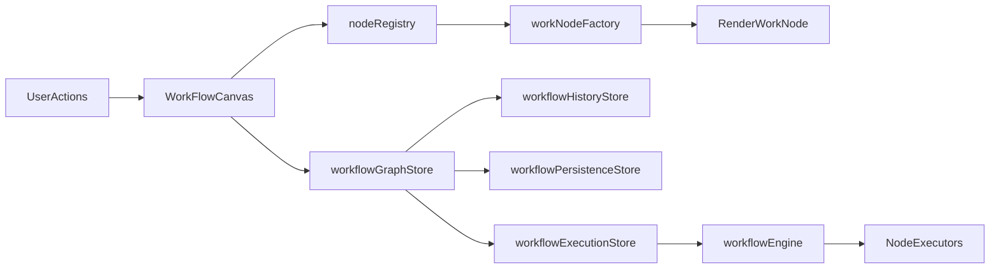
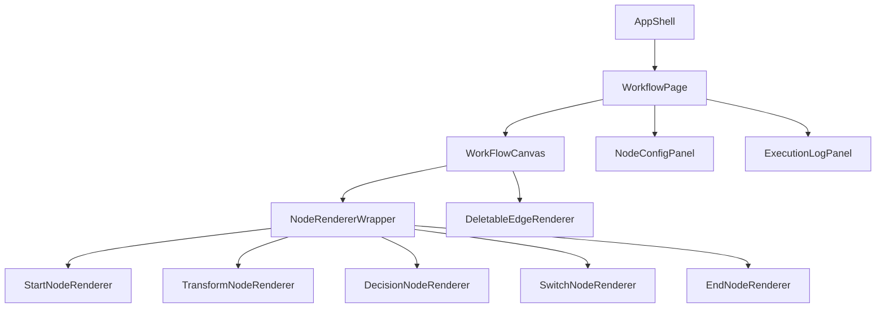
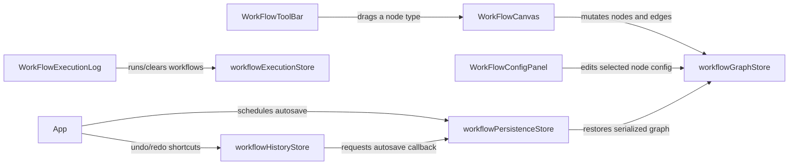
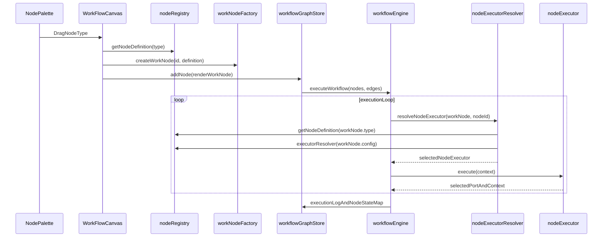

# Project Overview

Visual Workflow Studio is a visual DAG editor built with Vue 3 and TypeScript. You drag nodes onto a canvas, connect them into a workflow, configure behavior per node, and run the flow to inspect execution logs step by step.

Today the built-in node types are `START`, `TRANSFORM`, `DECISION`, `SWITCH`, and `END`. The execution engine moves through the graph by following the output port selected by each node executor. Workflows can be exported/imported as JSON, and canvas state is autosaved locally.


# Setup

## Prerequisites

- Node.js 20+
- npm 10+

## Install and run

```bash
npm install
npm run dev
```

## Build, preview, and test

```bash
npm run build
npm run preview
npm run test
```

# Architecture

## High Level Design

At a high level, the system works like a closed loop between UI intent, graph state, and runtime execution.  
When a user drags, connects, edits, or deletes on the canvas, [`WorkFlowCanvas`](src/components/WorkFlowCanvas.vue) emits change events and the graph store applies only the required mutation. That updated graph state then becomes the single source used by two downstream paths: persistence (autosave/import-export) and execution (engine run + node status).  
Node behavior is type-driven through the registry and factory pipeline, so rendering, graph mutation, and runtime execution stay decoupled while sharing one graph state model.

In short, the architecture follows this event flow:

1. **User action on canvas** -> event stream (`add`, `move`, `connect`, `config change`).
2. **Graph mutation boundary** -> [`workflowGraphStore`](src/stores/workflowGraphStore.ts) updates nodes/edges/indexes.
3. **System side effects** -> history tracking + autosave scheduling.
4. **Execution path** -> engine reads graph snapshot and runs node executors.
5. **Feedback path** -> execution log and per-node state feed UI highlights and diagnostics.



Project structure and key components:

- [`src/components/`](src/components/)
  - [`WorkFlowCanvas.vue`](src/components/WorkFlowCanvas.vue): drag/drop, connect, node/edge change streams.
  - [`nodeRenderers/*`](src/components/nodeRenderers/): node visual contracts per type.
  - [`edgeRenderers/*`](src/components/edgeRenderers/): edge-level controls (for example delete edge interaction).
- [`src/stores/`](src/stores/)
  - [`workflowGraphStore.ts`](src/stores/workflowGraphStore.ts): graph domain state + normalized indexes.
  - [`workflowHistoryStore.ts`](src/stores/workflowHistoryStore.ts): command history, undo/redo lifecycle.
  - [`workflowPersistenceStore.ts`](src/stores/workflowPersistenceStore.ts): autosave, import/export, restore.
  - [`workflowExecutionStore.ts`](src/stores/workflowExecutionStore.ts): runtime execution log + node execution states.
  - [`globalUIStore.ts`](src/stores/globalUIStore.ts): global modal/dialog state with consumer-defined action callbacks.
- [`src/engine/`](src/engine/)
  - [`workflowEngine.ts`](src/engine/workflowEngine.ts): validation rules, DAG build, execution loop.
  - [`executors/*`](src/engine/executors/): specialized execution strategies.
- [`src/registry/nodeRegistry.ts`](src/registry/nodeRegistry.ts)
  - node definitions, config schema, `executorResolver`, optional `portResolver`.
- [`src/factory/workNodeFactory.ts`](src/factory/workNodeFactory.ts)
  - creates work nodes from registry definitions.
- [`src/config/workflowConstants.ts`](src/config/workflowConstants.ts)
  - centralized limits and policy flags.

# UI Component Design and Minimal Design System

The UI follows layered composition so behavior and presentation can evolve without rewriting the complete workflow surface.



Component boundaries:

- [`WorkFlowCanvas`](src/components/WorkFlowCanvas.vue) handles canvas-level interactions (drag/drop, connect, selection, and change streams).
- Node renderers handle node-specific visuals and interactions.
- [`DeletableEdgeRenderer`](src/components/edgeRenderers/DeletableEdgeRenderer.vue) handles edge-local actions.
- Configuration UI handles schema-driven editing of node config.
- Execution log UI handles runtime visibility and error feedback.

Minimal design system principles:

- Use a compact token set for spacing, radius, typography, and semantic colors.
- Keep interaction states explicit: normal, hover, selected, executing, success, and error.
- Reuse semantic tokens first, then add new values only when a clear new role appears.
- Keep visual rules consistent across node and edge surfaces.

Accessibility baseline:

- Visible keyboard focus for interactive controls.
- High contrast for selected/error/success states.
- Comfortable interaction targets for delete and edge actions.

Pros and cons of this minimal system:

- ✅ Pros: faster UI extension, visual consistency, easier theme evolution.
- ⚠️ Cons: token governance is required to avoid style drift.

# State Management

State is split across Pinia stores by responsibility:

- [`workflowGraphStore`](src/stores/workflowGraphStore.ts): graph nodes/edges, adjacency indexes, selection, and graph mutation primitives.
- [`workflowHistoryStore`](src/stores/workflowHistoryStore.ts): command history lifecycle ([`run`](src/stores/helpers/workflowCommandHistory.ts), [`undo`](src/stores/helpers/workflowCommandHistory.ts), [`redo`](src/stores/helpers/workflowCommandHistory.ts)) with bounded depth.
- [`workflowPersistenceStore`](src/stores/workflowPersistenceStore.ts): autosave scheduling, import/export, and restore from local storage.
- [`workflowExecutionStore`](src/stores/workflowExecutionStore.ts): execution lifecycle, execution logs, and per-node execution status.
- [`globalUIStore`](src/stores/globalUIStore.ts): Main use case is to keep global ui state like confirmation modal, toast , banner etc. Right now it has confirmation modal with state (`title`, `message`, `actionButtonMap`) and does some action orchestration.

Interaction shape:

`UI event -> graph command -> history update -> autosave (optional) -> execution state update (when run is triggered)`

This separation keeps each store focused while still allowing them to compose cleanly.

## Component-store wiring

The toolbar, canvas, config panel, execution log, and root application shell all rendezvous through the stores whenever a user drags, configures, or runs a workflow.



- ✅ Pros: keeps each component aligned with the store that owns its domain while the graph, history, persistence, and execution concerns remain isolated.
- ⚠️ Cons: the coordination surface grows when multiple stores need to react to the same UI event, so the diagram above documents the expectations for bordering flows before they become hard to follow.

## Performance Consideration

For larger workflows, the graph layer is optimized for targeted updates rather than full collection replacement.

The graph store uses:

- `nodeById: Map<string, RenderWorkNode>`
- `edgeById: Map<string, Edge>`
- `adjacencyByNodeId: Map<string, Set<string>>`

Why this matters:

- Node/edge lookup and incident-edge operations stay fast (O(1) style lookups).
- Dynamic port changes can remove only invalid affected edges instead of filtering every edge.
- `splice` updates preserve top-level array identity, which aligns better with Vue Flow change streams ([`applyNodeChanges`](src/stores/workflowGraphStore.ts), [`applyEdgeChanges`](src/stores/workflowGraphStore.ts)).

Pros and cons of this approach:

- ✅ Pros: better scaling behavior for dense workflows and lower reactive fan-out.
- ⚠️ Cons: more index consistency rules to maintain (handled by graph consistency assertions in development).

Hard limits and policy flags are centralized in [`src/config/workflowConstants.ts`](src/config/workflowConstants.ts) (for example `MAX_EXECUTION_STEPS`, autosave debounce, undo/redo depth, zoom bounds, and edge validation toggle).

## Low Level Design

In low level design I am covering only key flows.

### Workflow runtime flow

`workflowEngine` runs as a deterministic traversal loop over the current graph snapshot.

1. Build adjacency and validate DAG invariants.
2. Locate the single `START` node and initialize execution context.
3. On each step, resolve an executor from registry using current `workNode` type + config.
4. Execute the resolved node executor and capture selected output port.
5. Append execution log and node status updates.
6. Move to the next node from selected port; stop when no next node exists or an execution error is captured.



Runtime flow function links:

- [`getNodeDefinition(type)`](src/registry/nodeRegistry.ts)
- [`createWorkNode(id, definition)`](src/factory/workNodeFactory.ts)
- [`addNode(renderWorkNode)`](src/stores/workflowGraphStore.ts)
- [`executeWorkflow(nodes, edges)`](src/engine/workflowEngine.ts)
- [`resolveNodeExecutor(workNode, nodeId)`](src/engine/nodeExecutorResolver.ts)
- [`executorResolver(config)`](src/registry/nodeRegistry.ts)

### How node generation works

Node generation follows a small pipeline:

1. Canvas receives a node type from drag/drop.
2. Registry returns a `NodeDefinition`.
3. Factory creates a `workNode` instance with default config.
4. UI wraps it as `RenderWorkNode` (with live port definition) and inserts it into graph state.

[`NodeDefinition`](src/registry/nodeRegistry.ts) is the key extension contract. It contains default config, schema for config UI, port metadata, and [`executorResolver(config)`](src/registry/nodeRegistry.ts). For dynamic branching nodes (like `SWITCH`), [`portResolver(config)`](src/registry/nodeRegistry.ts) can recalculate output ports at runtime.

### Why this makes new WorkNodes easy to add

To add a new node type, you usually only touch four places:

1. Register the node definition in [`src/registry/nodeRegistry.ts`](src/registry/nodeRegistry.ts).
2. Implement executor behavior in [`src/engine/executors/`](src/engine/executors/).
3. Add a node renderer in [`src/components/nodeRenderers/`](src/components/nodeRenderers/).
4. Wire the renderer slot in [`src/components/WorkFlowCanvas.vue`](src/components/WorkFlowCanvas.vue).

Pros and cons:

- ✅ Pros: strong separation of concerns, better extensibility, node-specific behavior stays local.
- ⚠️ Cons: a bit more moving pieces, and new contributors need to learn the registry/factory/executor contract.

## Code Quality

Code quality is driven by architecture boundaries first, then tests and runtime checks:

- Stores follow clear single-responsibility boundaries.
- Hard-coded runtime values are centralized in `WORKFLOW_CONSTANTS`.
- Workflow import/export is isolated behind serialization/validation boundaries.
- The engine captures execution errors into structured runtime state for renderer feedback.
- Vitest covers important graph, history, and engine behaviors.
