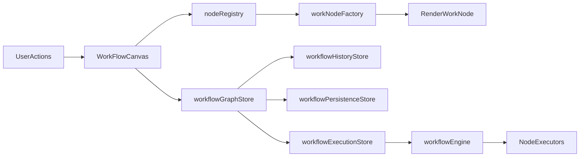
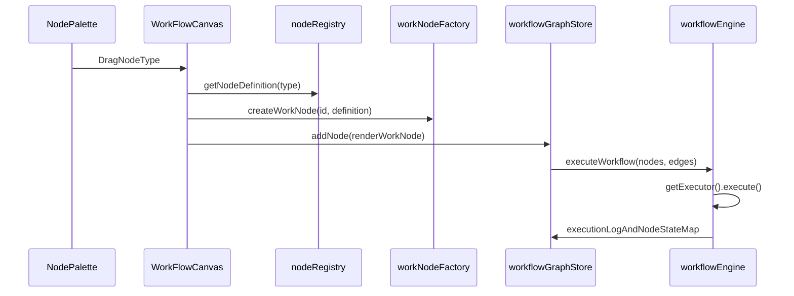

# Project Overview

Visual Workflow Studio is a Vue 3 + TypeScript workflow builder where you drag nodes, connect them as a DAG, run data simulation, and inspect step-by-step execution logs.

- 🎯 **Core idea:** turn workflow authoring into a visual canvas with strict graph rules.
- 🧩 **Built-in node categories:** `START`, `TRANSFORM`, `DECISION`, `SWITCH`, `END`.
- ▶️ **Execution model:** each node resolves its own executor strategy, then the engine walks node-to-node via output ports.
- 💾 **Persistence:** export/import JSON and autosave snapshot restore from local storage.

# Setup

## Prerequisites

- Node.js 20+
- npm 10+

## Install and run

```bash
npm install
npm run dev
```

## Build, preview, test

```bash
npm run build
npm run preview
npm run test
```

# Architectural

High-level flow of UI, graph state, execution, and persistence:



Project structure and key components:

- `src/components/`
  - `WorkFlowCanvas.vue`: drag/drop, connect, node/edge change streams.
  - `nodeRenderers/*`: node visual contracts per type.
  - `edgeRenderers/*`: edge-level controls (for example delete edge interaction).
- `src/stores/`
  - `workflowGraphStore.ts`: graph domain state + normalized indexes.
  - `workflowHistoryStore.ts`: command history, undo/redo lifecycle.
  - `workflowPersistenceStore.ts`: autosave, import/export, restore.
  - `workflowExecutionStore.ts`: runtime execution log + node execution states.
- `src/engine/`
  - `workflowEngine.ts`: validation rules, DAG build, execution loop.
  - `executors/*`: specialized execution strategies.
- `src/registry/nodeRegistry.ts`
  - node definitions, config schema, `executorResolver`, optional `portResolver`.
- `src/factory/workNodeFactory.ts`
  - creates work nodes from registry definitions.
- `src/config/workflowConstants.ts`
  - centralized limits and policy flags.

## Low Level Design

### Workflow and node creation lifecycle



### How node generation works

- 🏗️ **Pattern stack:** Registry + Factory + Strategy.
- `NodeDefinition` controls: default config, config schema, port definition, executor resolver.
- `createWorkNode(id, definition)` returns a node that resolves executor from the current config.
- `RenderWorkNode` wraps `workNode` + live `portDefinition` for Vue Flow rendering.
- `portResolver` enables dynamic ports (for example `SWITCH` cases).

### Why this pattern is extensible

To add a new WorkNode type, you usually:

1. Register a new `NodeDefinition` in `nodeRegistry`.
2. Add a node executor in `src/engine/executors/`.
3. Add its renderer in `src/components/nodeRenderers/`.
4. Wire the renderer slot in `WorkFlowCanvas.vue`.

Pros and cons of this model:

- ✅ **Pros**
  - Open for extension with minimal changes in core graph logic.
  - Node-specific behavior stays local (schema + ports + executor).
  - Dynamic branching supports richer control-flow nodes.
- ⚠️ **Cons**
  - More moving parts than a single monolithic node class.
  - New node authors must understand schema, execution, and render contracts.

# State Management

Pinia stores are split by responsibility boundaries:

- `workflowGraphStore`
  - Owns nodes/edges, adjacency, and atomic graph mutations.
  - Uses normalized indexes (`nodeById`, `edgeById`, `adjacencyByNodeId`) for targeted operations.
- `workflowHistoryStore`
  - Owns command history lifecycle (`run`, `undo`, `redo`) with depth tracking.
  - Caps history via `WORKFLOW_CONSTANTS.MAX_UNDO_REDO_HISTORY_STEPS`.
- `workflowPersistenceStore`
  - Owns autosave schedule and storage boundaries.
  - Uses centralized policies like `WORKFLOW_AUTOSAVE_DEBOUNCE_MS`.
- `workflowExecutionStore`
  - Owns runtime flags (`isExecuting`), execution logs, and node execution state map.

Interaction flow:

- UI event -> graph mutation command -> history sync -> optional autosave -> execution/log updates when run starts.

## Performance Consideration

For larger graphs (for example ~100 nodes), the design focuses on selective updates instead of broad array replacement.

- ⚡ **Data structures chosen for scale**
  - `Map<string, RenderWorkNode>` and `Map<string, Edge>` for O(1) entity lookup.
  - `Map<string, Set<string>>` adjacency index for fast incident-edge operations.
- 🎯 **Selective node/edge change**
  - `applyNodeChanges` and `applyEdgeChanges` process granular canvas updates.
  - Dynamic port changes remove only invalid incident edges, not the whole edge list.
  - `splice`-based updates preserve top-level array identity used by Vue Flow consumers.
- 🧠 **Safety limits via centralized flags**
  - `MAX_EXECUTION_STEPS` guards against runaway loops.
  - `EDGE_VALIDATION_ENABLED` controls connection-rule enforcement.

This is aligned with the selective-render refactor captured in `docs/graph_render_performance_audit.md`.

## Code Quality

- ✅ **Single-responsibility store boundaries**
  - Graph, history, persistence, and execution concerns are isolated.
- ✅ **Policy centralization**
  - Runtime limits and hard-coded values are consolidated in `WORKFLOW_CONSTANTS`.
- ✅ **Validation and consistency checks**
  - Graph consistency assertions run in non-production builds.
  - Workflow import/export uses serialization + validation boundaries.
- ✅ **Testing surface**
  - Store and engine behavior are covered through Vitest suites.
- ✅ **Error handling layers**
  - Executor-level throw, engine capture, store mapping, and renderer feedback pipeline.
