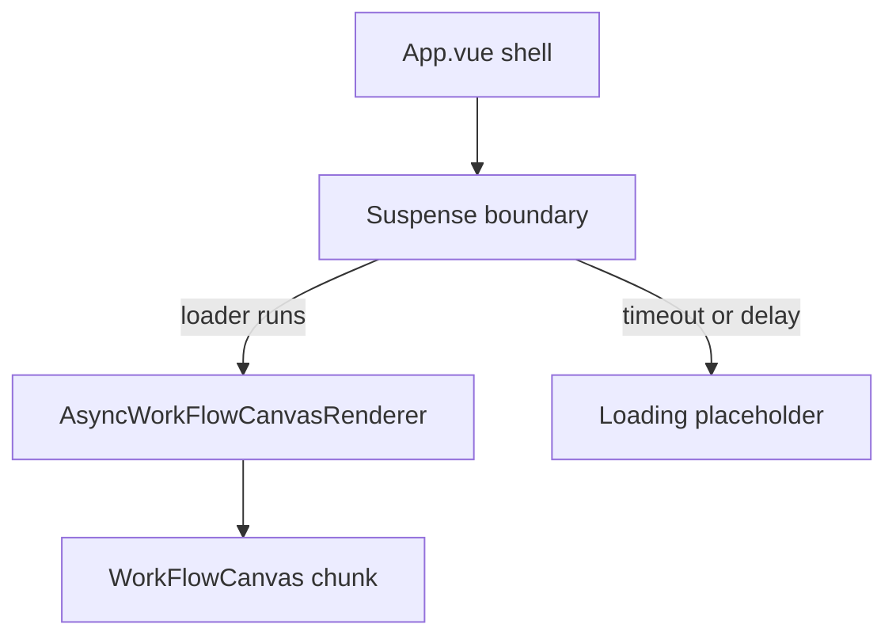

Spec:

1. Node Palette: Create a left-side palette containing at least three node types:
   a. Start Node
   b. Transform Node
   c. If-else Condition Node
   d. End Node
   Users should be able to drag nodes from the palette onto the workflow canvas.

2. Canvas (Flow Builder UI): Implement a central canvas area where users can:
   a. Drag nodes from the palette
   b. Move nodes around
   c. Connect nodes using edges
   d. Pan and zoom across the canvas
   You can use a library like Vue Flow or any similar solution to assist with rendering nodes
   and connections.

3. Node Configuration Panel: When a node is selected, open a right-side panel or modal
   where users can configure that node. Examples:

a. Start Node: input payload (e.g., {"message": "hello"})
b. Transform Node: transformation logic (uppercase, append text, multiply number,etc.)
c. End Node: display final received payload

All configuration values must be fully reactive and stored in the application state.

4. Workflow State Management: Use Pinia/Vuex (preferred) or another state management library.The store should maintain nodes, edges, configuration, and their positions on the canvas.State should update when:

a. Nodes are added
b. Nodes are moved
c. Edges are created or removed
d. Configuration changes
e. Canvas is interacted with (zoom, pan, selection)

5. Run Workflow Simulation:Implement a "Run Workflow" feature that simulates the flow of data from the Start Node through all connected nodes in sequence.

Example flow:

Start Node output -> Transform Node (applies transformation) -> End Node
Display the execution logs in a panel:
Start Node -> { message: "hello" }
Transform Node -> { message: "HELLO" }
End Node -> { message: "HELLO" } 6. Save / Load Workflow: Implement export and import features:

a. Export the workflow as JSON (nodes, edges, configuration, positions).

b. Import the JSON to restore the workflow state.

## Tech Stack

a. Vite + TypeScript + Vue 3
b. State Management - Pinia

## Architecture

The architecture use robust strategy to looking aspects like

Performance

- Handling Large Node Work Flow
- Only targeting specific node change which

### Component Performance

The `WorkFlowCanvas` is marked as a heavy component because it wires the entire canvas, node renderers, and third-party visualization helpers. The split policy defined in `HEAVY_COMPONENT_SPLIT_POLICY.workflowCanvas` keeps the load timeout, fallback delay, and chunk name centralized so timing policies only live in one place and can be tuned without scattering numbers across the tree.

High-level view:

```
App.vue (shell)
│
└── Suspense boundary for AsyncWorkFlowCanvasRenderer
    │
    └── WorkFlowCanvas chunk (lazy-loaded bundle)
```

Low-level flow:



**Pros**

- Defers the heavy Vue Flow canvas until the user reaches the main layout, shrinking the initial bundle by the weight of the renderer + helpers.
- Centralized `HEAVY_COMPONENT_SPLIT_POLICY.workflowCanvas` keeps timeout/fallback rules in one place, making it easier to tune retries or telemetry signals later.
- Fallback content keeps the layout stable while the chunk downloads, so the rest of the page paints quickly.

**Cons**

- The async boundary can surface download failures, so logging/telemetry should catch loading errors and the fallback copy must stay purposeful.
- If the component is needed on first paint, there is a tiny delay for fetching the chunk, so the fallback needs to feel like a safe placeholder.

Accessiblity

Maintanablity

- How easy is to add a new category?
- Node Base system use design pattern Comsable with Factory + Registry for creation on new node
- Workflow Engine that runs over each node can choose the execution bases on registry pattern. Since each node has its own way to write its execution logic. It makes easy to change exectution logic without touching out nodes.
-
- How decouple the UI and Busingess logic are
- Modular code so each can have its own unit test
- Seperate module to handle export and import logic covering validations, seralization and deseralization.

User Experience Consideration

- Proper showcase of error during workflow execution. Invalid or broken nodes are highlited propery.

Basic Principle Behind Node Creation.

I called easch node as work node as each node does something.

class BaseWorkNode {
id: string
type: string,
inputPort: InputPort
outputPorts: OutputPort[]

config: Record<string, unknown>

abstract getExecutor(): NodeExecutor;
}

class TransformWork extends BaseWorkNode {
// UI Specific: specific to vue flow for node

// Defualt
constructor(id, type){
// To populate
id and type
}

getExecutor() {
// Return specific strategy based on config
if(this.config.mode === 'UPPERCASE') return new UppercaseExecutor();
if(this.config.mode === "LOWERCASE') return new LowercaseExecutor();

    return new DefaultDecisionExecutor();

}
}

class DecisionWorkNode extends BaseWorkNode {
// UI Specific: specific to vue flow for node

getExecutor() {
// Returns specific strategy based on config
if (this.config.mode === 'IF_ELSE') return new IfElseExecutor();
if (this.config.mode === 'SWITCH') return new SwitchExecutor();
return new DefaultDecisionExecutor();
}
}

A Node Executor that will have specialised logic and return next node to the WorkFlow executor.

interface NodeExecutor {
// Returns the OutputPort to traverse next
execute(workFlowContext: any, config: any, outputs: OutputPort[]): OutputPort;
}

// The "Specialized" Logic
class IfElseExecutor implements NodeExecutor {
execute(workFlowContext: any, config: any, outputs: OutputPort[]) {
// Logic: If data satisfies condition, go to Output 0, else Output 1
const condition = data.value > config.threshold;
return condition ? outputs[0] : outputs[1];
}
}

## State Management

Pinia is used to create stores and each store follows single responsibility boundaries:

- workflowGraphStore - graph nodes/edges state, adjacency indexes, and graph mutations
- workflowHistoryStore - UI command history with undo/redo depth tracking
- workflowPersistenceStore - autosave scheduling and import/export snapshot boundaries
- workflowExecutionStore - workflow runtime execution state and execution log

I am use a DAG design primarly to keep the worflow graph.

State action takes actomic mutation strategry for all types of mutation like add, update, removal of nodes and edges and based on the change it does specific node update. This is required as Vue Flow request array of nodes and edges. In the state the nodes and edges are keept read only and actual mutations are keept in Map that applies chages to these nodes and edges with proper consistancy validation.

Since workflow execution can change design of each node. This was required.

- globalStore - It takes cares of state that is required accross every store and ui component - Currenly I have added only theme here but we can add states like feature flag, user profile

The split-store design keeps graph, history, persistence, and execution concerns isolated while still composing together for workflow interactions.

RenderWorkNode it base of Node of Vue Flow . for example

type RenderWorkNode extends Node {
... value of vue flow node

workNode - The instance of work node droped from WorkViewToolBar

}

Actions

- updateNodeById
- updateConfigOfNodeId
- buildWorkFlow - takes nodes + edge and create DAG graph
- workflowExecutor - A while loop take run execute of the WorkNode and gets next node. The Strategy Executor will decide to send node or throw error.

## Components

Component design is kept resuable specially for nodes expereince like delete, on click to configure is for all nodes. And each node can have multiple output ports base on it node desing.

Trade Off of This Componsable + Strategy based design.

Pros:

- Easy to create new type of Node Category like API, MCP etc in future.

- A node can support any number of output ports make is simple to create complex node

- Schema base node configuration
- Each node reques it own execution logic.

Cons:

- Requirs good understanding of possible node configuration to be able to create new node
- More moving pieces.

## Each type of Node can validate and send a NodeErrorType error to workflow executor and highlites the node for better User Expereince.

The important part of any workflow system is proper node configuration and error may occur due mismatch expectation of workflow context and its own logic. So we need multy layer error handing. Also the layers can be independenlty testable giving us more confidence.

```
                          ┌──────────────────────────────┐
                          │  NodeExecutionError (new)     │
                          │  ─────────────────────────    │
                          │  nodeId, errorCode, message   │
                          └──────────┬───────────────────┘
                                     │ thrown by
                          ┌──────────▼───────────────────┐
                          │  Executors (validate-first)   │
  Layer 1: Throw          │  ─────────────────────────    │
                          │  Guard → Execute → Return     │
                          └──────────┬───────────────────┘
                                     │ caught by
                          ┌──────────▼───────────────────┐
                          │  Engine (try/catch per node)  │
  Layer 2: Capture        │  ─────────────────────────    │
                          │  Writes error to log entry    │
                          │  + populates nodeErrorMap     │
                          └──────────┬───────────────────┘
                                     │ stored in
                          ┌──────────▼───────────────────┐
                          │  Store (nodeExecutionStateMap)│
  Layer 3: Store          │  ─────────────────────────    │
                          │  Map<nodeId, ExecutionState>  │
                          │  { status, errorMessage? }    │
                          └──────────┬───────────────────┘
                                     │ reactive binding
                          ┌──────────▼───────────────────┐
                          │  Node Renderers (visual)      │
  Layer 4: Render         │  ─────────────────────────    │
                          │  🔴 red border + tooltip      │
                          │  ✅ green border on success   │
                          └──────────────────────────────┘
```

##
